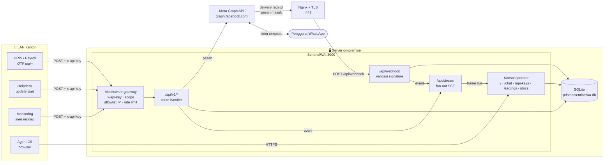

<div align="center">

# SentinelWA

**Gateway WhatsApp Business API on-premise dengan konsol operasi bergaya SOC.**

Satu endpoint internal untuk semua aplikasi kantor yang perlu mengirim OTP, notifikasi, atau
alert lewat WhatsApp — lengkap dengan telemetri kesehatan sistem, log event streaming, dan
inbox agent di atasnya.

`Next.js 14` · `SQLite + Prisma` · `Server-Sent Events` · `OpenAPI 3.0` · `Tailwind` · `Recharts`

</div>

---

## Daftar isi

1. [Apa ini sebenarnya](#1-apa-ini-sebenarnya)
2. [Arsitektur & alur](#2-arsitektur--alur)
3. [Prasyarat](#3-prasyarat)
4. [Instalasi](#4-instalasi)
5. [Deployment on-premise](#5-deployment-on-premise)
6. [Setup webhook Meta](#6-setup-webhook-meta)
7. [Cara memakai API internal](#7-cara-memakai-api-internal)
8. [Konsol operasi](#8-konsol-operasi)
9. [Referensi environment](#9-referensi-environment)
10. [Model keamanan](#10-model-keamanan)
11. [Operasional & troubleshooting](#11-operasional--troubleshooting)
12. [Struktur proyek](#12-struktur-proyek)

---

## 1. Apa ini sebenarnya

Kebanyakan kantor pada akhirnya punya tiga atau empat aplikasi yang sama-sama ingin mengirim pesan
WhatsApp — portal HR butuh OTP login, sistem ticketing butuh notifikasi status, monitoring butuh
alert. Memberikan access token Meta ke masing-masing aplikasi berarti empat salinan kredensial,
empat implementasi payload template, dan tidak ada satu tempat pun untuk melihat apa yang sudah
terkirim.

SentinelWA adalah satu tempat itu. Aplikasi internal memanggil HTTP API yang kecil dan stabil
dengan `x-api-key` miliknya sendiri; SentinelWA yang memegang kredensial Meta, berbicara dengan
Graph API, menerima delivery receipt, dan menampilkan apa yang sedang terjadi kepada operator.

**Yang dilakukan**

| | |
|---|---|
| **Gateway internal** | `send-otp`, `send-message`, `status/{id}`, `health` — autentikasi API key, ber-scope, ada rate limit, bisa dibatasi per IP |
| **Dashboard SOC** | Matriks kesehatan layanan, gauge runtime, grafik throughput/latency/delivery, konsol log streaming |
| **Webhook listener** | Penerima yang memvalidasi signature untuk pesan masuk, delivery receipt, dan perubahan status template |
| **CS command center** | Inbox agent tiga panel dengan pelacakan service window 24 jam dan macro balasan cepat |
| **API explorer** | Swagger UI di `/docs`, dihasilkan dari dokumen OpenAPI yang sama dengan yang disajikan gateway |

**Yang secara sengaja bukan tujuannya**: SaaS multi-tenant. State yang harus konsisten — bucket
rate limit, circuit breaker, fan-out SSE — disimpan di memori proses, dan justru itulah yang membuat
seluruh sistem bisa berjalan dari satu file SQLite tanpa Redis, tanpa Postgres, dan tanpa message
broker. Itu trade-off yang tepat untuk satu node on-premise. Baca
[Scaling](#scaling-lebih-dari-satu-node) sebelum Anda tergoda memakai cluster mode.

---

## 2. Arsitektur & alur



### Siklus hidup sebuah request — OTP

```
 ┌──────────────┐   1. POST /api/v1/send-otp
 │ Portal HRIS  │──────────────────────────────────┐
 └──────────────┘   x-api-key: swa_live_…          │
                    { "to": "+62812…",             │
                      "code": "482913" }           ▼
                                        ┌────────────────────────┐
                                        │  Middleware gateway    │
                                        │  ① lookup hash key     │
                                        │  ② cek pencabutan      │
                                        │  ③ allowlist IP        │
                                        │  ④ scope: otp.send     │
                                        │  ⑤ token bucket        │
                                        └───────────┬────────────┘
                                                    │ lolos
                                   2. baris dicatat ▼
                                        ┌────────────────────────┐
                                        │ Message(status=queued) │──► SQLite
                                        └───────────┬────────────┘
                                   3. kirim template│  (dijaga circuit breaker)
                                                    ▼
                                        ┌────────────────────────┐
                                        │  Meta Graph API        │
                                        │  POST /{phone-id}/…    │
                                        └───────────┬────────────┘
                                   4. wamid kembali │
                                                    ▼
                                        status=sent ──► SSE ──► dashboard
                                                    │
      ┌─────────────────────────────────────────────┘
      │  5. beberapa menit kemudian, Meta memanggil balik
      ▼
 POST /api/webhook  (x-hub-signature-256 diverifikasi)
      │
      └─► status=delivered → read     ──► SSE ──► dashboard + /api/v1/status/{id}
```

**Kenapa kode OTP tidak disimpan.** `send-otp` mencatat *panjang* kode dan sebuah string referensi,
bukan kodenya. Database gateway yang menyimpan one-time password aktif itu sama saja dengan
credential store, dan seharusnya tidak menjadi seperti itu.

---

## 3. Prasyarat

| Kebutuhan | Versi | Catatan |
|---|---|---|
| **Node.js** | ≥ 20.11 LTS (disarankan 22 LTS) | Cek `node -v`. Node 18 tidak bisa menjalankan build ini. |
| **npm / pnpm** | npm ≥ 10, atau pnpm ≥ 9 | Keduanya bisa; perintah di bawah menampilkan dua-duanya. |
| **SQLite** | tidak perlu diinstal | Prisma membawa engine sendiri. CLI `sqlite3` hanya berguna untuk inspeksi manual. |
| **Akun Meta Developer** | — | Lihat di bawah. |
| **Endpoint HTTPS publik** | — | Meta hanya mengirim webhook ke URL HTTPS yang bisa diakses publik dengan sertifikat valid. Self-signed tidak diterima. |
| **Build toolchain** | opsional | Hanya perlu jika ada native module yang harus dikompilasi di platform tidak umum. |

### Yang perlu disiapkan di sisi Meta

1. **Akun Meta Business** dengan bisnis yang sudah terverifikasi.
2. **Aplikasi Meta** bertipe *Business* dengan produk **WhatsApp** sudah ditambahkan.
3. **WhatsApp Business Account (WABA)** dan **nomor telepon** yang sudah terdaftar (beserta
   *Phone Number ID*-nya).
4. **System User** dengan **permanent access token** yang memiliki izin
   `whatsapp_business_messaging` dan `whatsapp_business_management`. Jangan pakai token sementara
   24 jam dari panel quickstart untuk apa pun selain uji coba pertama.
5. **Template autentikasi** yang sudah disetujui untuk pengiriman OTP (biasanya bernama
   `otp_verification`). Template autentikasi adalah satu-satunya cara yang andal untuk menjangkau
   pengguna di luar service window 24 jam.

> **Server air-gapped.** Aplikasinya sendiri tidak melakukan panggilan jaringan saat build — font
> memakai CSS stack biasa, bukan fetch ke Google Fonts. Yang butuh internet sekali adalah
> `npm install` dan `prisma generate`; setelah itu server hanya perlu egress ke
> `graph.facebook.com` dan ingress untuk webhook.

---

## 4. Instalasi

### 4.1 Clone dan install

```bash
git clone <url-repo-anda> SentinelWA
cd SentinelWA

npm install
# atau: pnpm install
```

`postinstall` menjalankan `prisma generate`, yang mengunduh Prisma query engine saat instalasi
pertama.

### 4.2 Konfigurasi environment

```bash
cp .env.example .env
```

Buat dua secret yang wajib ada sebelum aplikasi mau berjalan di mode production:

```bash
node -e "console.log('ENCRYPTION_KEY=' + require('crypto').randomBytes(32).toString('hex'))" >> .env
node -e "console.log('SESSION_SECRET=' + require('crypto').randomBytes(32).toString('hex'))" >> .env
```

Lalu buka `.env` dan isi minimal:

```dotenv
APP_PUBLIC_URL=https://wa-gateway.corp.example.com
CONSOLE_PASSWORD=<passphrase panjang untuk konsol operator>
```

Kredensial Meta bisa ditaruh di `.env` **atau** diketik di `/settings` nanti — pengaturan yang
dimasukkan lewat konsol dienkripsi dengan AES-256-GCM dan disimpan di SQLite, dan nilainya
mengalahkan `.env`.

> ⚠️ **`ENCRYPTION_KEY` tidak bisa dirotasi di tempat.** Kalau diganti, semua kredensial Meta yang
> tersimpan menjadi tidak bisa didekripsi dan Anda harus memasukkannya ulang di `/settings`.
> Backup key ini sama hati-hatinya dengan token yang dilindunginya.

### 4.3 Inisialisasi database

```bash
# Development lokal — membuat file dan menerapkan migrasi
npx prisma migrate dev

# Production / deploy berulang — hanya menerapkan migrasi yang sudah di-commit
npx prisma migrate deploy
```

File database akan berada di `prisma/sentinelwa.db` (sesuai `DATABASE_URL`). File ini masuk
`.gitignore`; backup sebagai file — lihat [Backup](#backup).

Untuk melihat isinya kapan saja:

```bash
npx prisma studio
```

### 4.4 Terbitkan API key pertama

Tanpa key, tidak ada yang bisa memanggil gateway. Buka `/api-keys` di konsol, atau lewat terminal:

```bash
npm run key:create -- --name "hris-payroll" --scopes otp.send,status.read --rate 240
```

```
  ┌─ SentinelWA :: credential issued ────────────────────────────
  │  consumer  hris-payroll
  │  scopes    otp.send,status.read
  │  limit     240 req/min
  │  sources   any
  ├──────────────────────────────────────────────────────────────
  │  swa_live_9f2a1c4e7b8d3a05f6c1e9b2d7a4f083c5e6b1d9
  └─ store it now — only the SHA-256 digest is persisted ────────
```

Nilai plaintext hanya ditampilkan **sekali**. Yang ditulis ke database hanya `SHA-256(key)`,
sehingga backup database yang dicuri tidak bisa dipakai ulang untuk memanggil gateway.

### 4.5 Jalankan

```bash
# Development — hot reload di http://localhost:3000
npm run dev

# Production
npm run build
npm run start
```

Perintah tambahan yang berguna:

```bash
npm run typecheck      # tsc --noEmit
npm run lint           # next lint
npm run db:studio      # Prisma Studio
```

---

## 5. Deployment on-premise

Bentuknya: **Nginx menangani TLS di :443 → Node mendengarkan di :3000, hanya di localhost.**
Node tidak pernah diekspos langsung.

### 5.1 Build dan tempatkan aplikasi

```bash
sudo mkdir -p /opt/sentinelwa && sudo chown "$USER" /opt/sentinelwa
cd /opt/sentinelwa
git clone <url-repo-anda> .

npm ci
cp .env.example .env && $EDITOR .env      # isi secret
npx prisma migrate deploy
npm run build
mkdir -p logs
```

### 5.2 Jalankan dengan PM2

```bash
npm install -g pm2

pm2 start ecosystem.config.js --env production
pm2 save
pm2 startup            # menampilkan sebuah perintah — jalankan dengan sudo agar bertahan setelah reboot
```

Operasi sehari-hari:

```bash
pm2 status
pm2 logs sentinelwa --lines 100
pm2 restart sentinelwa
pm2 reload sentinelwa      # graceful
pm2 monit
```

`ecosystem.config.js` sengaja mengunci `instances: 1` / `exec_mode: 'fork'`.

<a name="scaling-lebih-dari-satu-node"></a>
> **Jangan pindah ke cluster mode tanpa perubahan.** Bucket rate limit, circuit breaker Meta, dan
> fan-out SSE semuanya hidup di memori proses. Dengan empat worker, key yang dibatasi 120 req/menit
> praktis mendapat 480, circuit breaker terbuka sendiri-sendiri di tiap worker, dan dashboard hanya
> melihat event dari worker tempat stream-nya kebetulan mendarat. Jalur yang didukung adalah scaling
> vertikal; scaling horizontal berarti memindahkan tiga hal itu ke Redis terlebih dahulu.

### 5.3 Reverse proxy Nginx

Konfigurasi lengkap dengan komentar tersedia di [`deploy/nginx.conf`](deploy/nginx.conf).

```bash
sudo cp deploy/nginx.conf /etc/nginx/sites-available/sentinelwa
sudo $EDITOR /etc/nginx/sites-available/sentinelwa      # sesuaikan server_name
sudo ln -s /etc/nginx/sites-available/sentinelwa /etc/nginx/sites-enabled/
sudo nginx -t && sudo systemctl reload nginx
```

Dua pengaturan di file itu tidak boleh dilewatkan:

```nginx
location /api/stream {
    proxy_pass http://sentinelwa_app;
    proxy_buffering off;        # tanpa ini, dashboard live datang tersendat-sendat
    proxy_read_timeout 24h;     # tanpa ini, stream terputus tiap 60 detik
    gzip off;
    chunked_transfer_encoding on;
}
```

Konfigurasi itu juga menunjukkan di mana akses sebaiknya dibatasi. Pembagian yang masuk akal:

| Path | Siapa yang boleh mengakses |
|---|---|
| `/api/webhook` | Internet publik — Meta harus bisa menjangkaunya |
| `/api/v1/*` | Hanya range IP kantor (`allow 10.0.0.0/8; deny all;`) |
| `/` (konsol) | Hanya LAN manajemen |

### 5.4 TLS dengan Let's Encrypt

```bash
sudo apt install certbot python3-certbot-nginx
sudo mkdir -p /var/www/certbot

sudo certbot --nginx -d wa-gateway.corp.example.com

# perpanjangan otomatis dipasang sebagai systemd timer; verifikasi
sudo certbot renew --dry-run
systemctl list-timers | grep certbot
```

Kalau server tidak menerima koneksi masuk di port 80 dari internet, gunakan challenge DNS-01 dengan
plugin certbot milik penyedia DNS Anda.

### 5.5 Firewall

```bash
sudo ufw allow 80/tcp        # ACME + redirect
sudo ufw allow 443/tcp       # HTTPS
sudo ufw deny  3000/tcp      # Node tetap di balik Nginx
sudo ufw enable
```

### 5.6 Verifikasi deployment

```bash
# 1. Node hidup di belakang proxy
curl -s -o /dev/null -w '%{http_code}\n' https://wa-gateway.corp.example.com/login       # 200

# 2. Gateway menolak panggilan tanpa autentikasi
curl -s https://wa-gateway.corp.example.com/api/v1/health | jq       # 401 UNAUTHORIZED

# 3. …dan menerima key yang benar
curl -s -H "x-api-key: $SENTINEL_KEY" \
     https://wa-gateway.corp.example.com/api/v1/health | jq '.status'

# 4. SSE benar-benar streaming (frame harus muncul bertahap, bukan menggantung lalu tumpah sekaligus)
curl -N https://wa-gateway.corp.example.com/api/stream
```

---

## 6. Setup webhook Meta

### 6.1 Konfigurasi SentinelWA terlebih dahulu

Buka **`/settings`** dan isi:

| Kolom | Sumbernya |
|---|---|
| System User Permanent Access Token | Business Settings → System Users → Generate token |
| Phone Number ID | WhatsApp → API Setup |
| Business Account ID (WABA) | WhatsApp → API Setup |
| App Secret | App Dashboard → Settings → Basic |
| Webhook Verify Token | **Anda yang menentukan.** String acak yang panjang. |
| Public HTTPS origin | mis. `https://wa-gateway.corp.example.com` |

Simpan, lalu tekan **Execute handshake**. Tombol itu memanggil
`GET /{version}/{phone-number-id}` dan melaporkan nomor tampilan, verified name, dan quality rating.
Hasil hijau berarti token, phone number ID, dan versi API sudah cocok satu sama lain.

Halaman settings menampilkan **callback URL** persis yang harus di-paste ke Meta:

```
https://wa-gateway.corp.example.com/api/webhook
```

### 6.2 Konfigurasi di Meta

1. **App Dashboard → WhatsApp → Configuration → Webhook → Edit**
2. **Callback URL** — URL di atas.
3. **Verify token** — string yang persis sama dengan yang disimpan di `/settings`.
4. **Verify and save.** Meta langsung mengirim `GET /api/webhook?hub.mode=subscribe&…`;
   SentinelWA mengembalikan `hub.challenge` jika token cocok. Baris
   `INFO webhook Verification handshake accepted` akan muncul di konsol log live saat itu juga.
5. **Manage → subscribe** minimal ke:
   - `messages` — pesan masuk **dan** semua delivery receipt (`sent`, `delivered`, `read`, `failed`)
   - `message_template_status_update` — pemberitahuan persetujuan/penolakan template

### 6.3 Konfirmasi bahwa semuanya bekerja

Kirim pesan WhatsApp *ke* nomor bisnis Anda dari sebuah ponsel. Dalam satu-dua detik:

- baris `INFO webhook Inbound text from …` muncul di konsol log,
- kontaknya muncul di **`/chat`** dengan penanda belum dibaca,
- kartu **Webhook Listener** di dashboard berubah menjadi *operational* dengan timestamp baru.

### 6.4 Kalau verifikasi gagal

| Gejala | Penyebab |
|---|---|
| Meta bilang "The callback URL or verify token couldn't be validated" | Token tidak cocok, atau URL tidak bisa dijangkau dari internet publik. Uji dengan `curl` **dari luar jaringan Anda**. |
| Verifikasi lolos tapi tidak ada callback masuk | Sudah verify tapi belum subscribe ke field `messages`. |
| `CRITICAL webhook Rejected payload with invalid x-hub-signature-256` | **App Secret** di `/settings` salah, atau berasal dari aplikasi yang berbeda dengan yang mengirim webhook. |
| Error sertifikat di tester Meta | Rantai sertifikat tidak lengkap. Gunakan `fullchain.pem`, bukan `cert.pem`. |

---

## 7. Cara memakai API internal

Setiap panggilan membawa `x-api-key`. Setiap response membawa `X-Request-Id`, dan response yang
kena rate limit membawa `X-RateLimit-Limit` / `-Remaining` / `-Reset`.

Dokumentasi interaktif dengan **Try it out** yang berfungsi ada di **`/docs`**; dokumen mentahnya
di `/api/openapi`.

### 7.1 `POST /api/v1/send-otp`

Mengirim kode sekali pakai lewat template autentikasi Meta — bisa dikirim di luar service window
24 jam. Scope: `otp.send`.

<details open>
<summary><b>curl</b></summary>

```bash
curl -sS -X POST https://wa-gateway.corp.example.com/api/v1/send-otp \
  -H "Content-Type: application/json" \
  -H "x-api-key: swa_live_9f2a1c4e7b8d3a05f6c1e9b2d7a4f083c5e6b1d9" \
  -d '{
        "to": "+6281234567890",
        "code": "482913",
        "template_name": "otp_verification",
        "language": "en_US",
        "reference": "payroll-login-8823"
      }' | jq
```

```json
{
  "ok": true,
  "message_id": "wamid.HBgNNjI4MTIzNDU2Nzg5MBUCABEYEjc5N0YxRjA4…",
  "record_id": "clx8n2k9q0000v3l8f1p2c9d4",
  "status": "sent",
  "to": "6281234567890",
  "template": "otp_verification",
  "latency_ms": 412,
  "request_id": "a91f3c02b7d4e5f6"
}
```
</details>

<details>
<summary><b>JavaScript — fetch</b></summary>

```js
// otp.js — Node 20+ atau runtime browser modern
const GATEWAY = process.env.SENTINEL_URL ?? 'https://wa-gateway.corp.example.com';
const API_KEY = process.env.SENTINEL_KEY; // jangan pernah di-hard-code

export async function sendOtp(to, code, reference) {
  const res = await fetch(`${GATEWAY}/api/v1/send-otp`, {
    method: 'POST',
    headers: {
      'Content-Type': 'application/json',
      'x-api-key': API_KEY,
    },
    body: JSON.stringify({ to, code, reference }),
  });

  const body = await res.json();

  if (!res.ok) {
    // 429 → mundur dulu; 502 → Meta menolak; 401/403 → masalah ada di key Anda
    const retryAfter = Number(res.headers.get('retry-after') ?? 0);
    throw Object.assign(new Error(body.error?.message ?? 'send-otp gagal'), {
      code: body.error?.code,
      status: res.status,
      requestId: body.request_id,
      retryAfter,
    });
  }

  return body; // { message_id, record_id, status, latency_ms, … }
}

// contoh pemakaian
const otp = String(Math.floor(100000 + Math.random() * 900000));
const { message_id } = await sendOtp('+6281234567890', otp, 'payroll-login-8823');
console.log('terkirim', message_id);
```
</details>

<details>
<summary><b>Python — requests</b></summary>

```python
# otp.py
import os
import random
import requests

GATEWAY = os.environ.get("SENTINEL_URL", "https://wa-gateway.corp.example.com")
API_KEY = os.environ["SENTINEL_KEY"]          # jangan pernah di-hard-code

session = requests.Session()
session.headers.update({
    "Content-Type": "application/json",
    "x-api-key": API_KEY,
})


class SentinelError(RuntimeError):
    def __init__(self, message, code=None, status=None, request_id=None):
        super().__init__(message)
        self.code = code
        self.status = status
        self.request_id = request_id


def send_otp(to: str, code: str, reference: str | None = None, timeout: int = 20) -> dict:
    res = session.post(
        f"{GATEWAY}/api/v1/send-otp",
        json={"to": to, "code": code, "reference": reference},
        timeout=timeout,
    )
    body = res.json()

    if not res.ok:
        err = body.get("error", {})
        raise SentinelError(
            err.get("message", "send-otp gagal"),
            code=err.get("code"),
            status=res.status_code,
            request_id=body.get("request_id"),
        )

    return body


if __name__ == "__main__":
    otp = f"{random.randint(0, 999999):06d}"
    result = send_otp("+6281234567890", otp, reference="payroll-login-8823")
    print("terkirim", result["message_id"], f'dalam {result["latency_ms"]}ms')
```
</details>

### 7.2 `POST /api/v1/send-message`

Pesan transaksional atau balasan agent. Scope: `message.send`.

```bash
# Teks bebas — HANYA di dalam service window 24 jam
curl -sS -X POST https://wa-gateway.corp.example.com/api/v1/send-message \
  -H "Content-Type: application/json" \
  -H "x-api-key: $SENTINEL_KEY" \
  -d '{
        "to": "+6281234567890",
        "message": "Tiket INC-4821 sudah selesai ditangani. Balas di sini kalau masih ada kendala.",
        "type": "text"
      }' | jq

# Template — berlaku kapan saja
curl -sS -X POST https://wa-gateway.corp.example.com/api/v1/send-message \
  -H "Content-Type: application/json" \
  -H "x-api-key: $SENTINEL_KEY" \
  -d '{
        "to": "+6281234567890",
        "message": "ticket_resolved",
        "type": "template",
        "language": "en_US",
        "components": [
          { "type": "body", "parameters": [
              { "type": "text", "text": "INC-4821" },
              { "type": "text", "text": "Network Operations" }
          ]}
        ]
      }' | jq
```

### 7.3 `GET /api/v1/status/{message_id}`

Menerima `wamid.…` dari Meta maupun `record_id` yang dikembalikan saat pengiriman.
Scope: `status.read`.

```bash
curl -sS -H "x-api-key: $SENTINEL_KEY" \
  "https://wa-gateway.corp.example.com/api/v1/status/wamid.HBgNNjI4MTIzNDU2Nzg5MBUC…" | jq
```

```json
{
  "ok": true,
  "message_id": "wamid.HBgNNjI4MTIzNDU2Nzg5MBUC…",
  "status": "read",
  "to": "6281234567890",
  "direction": "outbound",
  "timeline": {
    "created_at":   "2026-08-25T09:14:02.104Z",
    "sent_at":      "2026-08-25T09:14:02.516Z",
    "delivered_at": "2026-08-25T09:14:04.880Z",
    "read_at":      "2026-08-25T09:15:41.002Z",
    "failed_at":    null
  },
  "error": null,
  "request_id": "7d1e0c93aa5b2f48"
}
```

### 7.4 `GET /api/v1/health`

Mengembalikan `200` saat sehat dan **`503`** saat ada subsistem yang bermasalah — sehingga load
balancer atau uptime monitor bisa bertindak hanya berdasarkan status code. Scope: `health.read`.

```bash
curl -sS -H "x-api-key: $SENTINEL_KEY" \
  https://wa-gateway.corp.example.com/api/v1/health | jq
```

```json
{
  "ok": true,
  "status": "operational",
  "uptime_seconds": 184920,
  "system":    { "node": "v22.11.0", "cpu_percent": 3.4, "memory_percent": 41.2, "event_loop_p99_ms": 1.8 },
  "database":  { "ok": true, "read_ms": 0.31, "write_ms": 0.12, "size_bytes": 2179072 },
  "meta_api":  { "reachable": true, "latency_ms": 128, "circuit_breaker": "closed", "configured": true },
  "webhook":   { "last_payload_at": "2026-08-25T09:15:41.002Z", "queue_depth": 0, "error_rate": 0 },
  "request_id": "c40b8e1f92d3a765"
}
```

### 7.5 Kontrak error

Setiap kegagalan mengembalikan amplop yang sama:

```json
{
  "ok": false,
  "error": { "code": "RATE_LIMITED", "message": "Rate limit of 120 requests/minute exceeded." },
  "request_id": "e2a7…"
}
```

| HTTP | `error.code` | Yang harus dilakukan |
|---|---|---|
| 400 | `VALIDATION_ERROR` | Perbaiki payload — `error.details` menyebut field mana yang bermasalah. |
| 401 | `UNAUTHORIZED` | `x-api-key` tidak ada atau tidak dikenal. |
| 403 | `KEY_REVOKED` / `IP_NOT_ALLOWED` / `FORBIDDEN_SCOPE` | Perlu tindakan operator di `/api-keys`. |
| 404 | `NOT_FOUND` | Tidak ada pesan dengan identifier tersebut. |
| 428 | `NOT_CONFIGURED` | Kredensial Meta belum diisi. Buka `/settings`. |
| 429 | `RATE_LIMITED` | Hormati `Retry-After`; jangan looping tanpa jeda. |
| 502 | `META_ERROR` | Meta menolak — `error.details` membawa kode dari mereka. Biasanya masalah template atau service window. |
| 503 | `CIRCUIT_OPEN` | Meta sedang bermasalah; circuit breaker melindungi Anda. Coba lagi setelah jedanya lewat. |

**Sertakan `request_id` saat melaporkan masalah** — nilainya muncul apa adanya di konsol log,
sehingga insidennya bisa ditemukan dengan satu kali pencarian.

---

## 8. Konsol operasi

| Route | Kegunaannya |
|---|---|
| **`/`** | Matriks kesehatan (runtime, gateway Meta, webhook, database), gauge runtime, grafik throughput / latency / arus pesan / delivery, konsumen teratas, konsol log live, message tap |
| **`/chat`** | Inbox agent tiga panel: daftar triase dengan penanda belum dibaca, percakapan, dan panel inspector dengan hitung mundur service window 24 jam. Macro dipanggil dengan `/shortcut` atau `Ctrl`+`K`. |
| **`/api-keys`** | Menerbitkan, mengatur scope, membatasi rate, membatasi IP, mencabut, dan mengaktifkan kembali kredensial |
| **`/settings`** | Kredensial Meta, generator callback URL, versi API, mode simulasi, tes handshake |
| **`/docs`** | Swagger UI yang menembak gateway langsung |

**Konsol log** bisa difilter per tingkat keparahan dan teks bebas, bisa di-pause tanpa kehilangan
frame (baris yang tertahan dikeluarkan saat resume), bisa dibersihkan tanpa menyentuh database, dan
bisa diekspor sebagai JSON atau CSV sesuai filter yang aktif. Auto-scroll hanya mengikuti ekor log
selama Anda memang sedang berada di bagian bawah — menggulir ke atas untuk membaca stack trace akan
melepasnya, dan tombol *jump to tail* menyambungkannya kembali.

**Mode simulasi** (`/settings`, atau `MOCK_META=true`) mengakui setiap pengiriman secara lokal
dengan `wamid` sintetis dan tidak mengirim paket apa pun ke Meta. Cocok untuk latihan, demo, dan
pengembangan offline.

**Warna tidak pernah menjadi satu-satunya penanda.** Setiap status diberi label teks, tiap segmen
delivery diberi label langsung di sebelah ring, dan palet seri grafik sudah divalidasi untuk
gangguan penglihatan warna terhadap latar gelap yang dipakai.

---

## 9. Referensi environment

| Variabel | Default | Kegunaan |
|---|---|---|
| `NODE_ENV` | `development` | `production` mengaktifkan pemeriksaan wajib untuk secret. |
| `PORT` | `3000` | Port yang didengarkan Node. |
| `APP_PUBLIC_URL` | — | Origin HTTPS publik; dipakai untuk membentuk callback URL dan entri server di OpenAPI. |
| `DATABASE_URL` | `file:./sentinelwa.db` | Path SQLite, relatif terhadap direktori `prisma/`. |
| `ENCRYPTION_KEY` | — | **Wajib di production.** 32 byte, hex atau base64. Mengenkripsi kredensial Meta yang tersimpan. Tidak bisa dirotasi di tempat. |
| `SESSION_SECRET` | — | **Wajib di production.** Menandatangani cookie sesi operator. |
| `CONSOLE_PASSWORD` | — | Mengunci konsol. Dikosongkan berarti login dimatikan sepenuhnya. |
| `META_API_VERSION` | `v21.0` | Versi Graph API. |
| `META_ACCESS_TOKEN` | — | Permanent token milik system user. |
| `META_PHONE_NUMBER_ID` | — | Nomor pengirim. |
| `META_WABA_ID` | — | Business account, dipakai untuk laporan handshake. |
| `META_APP_SECRET` | — | Memvalidasi `x-hub-signature-256`. |
| `META_WEBHOOK_VERIFY_TOKEN` | — | Harus persis sama dengan kolom di App Dashboard. |
| `META_OTP_TEMPLATE_NAME` | `otp_verification` | Template autentikasi default. |
| `META_OTP_TEMPLATE_LANG` | `en_US` | Bahasa template default. |
| `MOCK_META` | `false` | Menyimulasikan pengiriman tanpa trafik keluar. |
| `DEFAULT_RATE_LIMIT_PER_MIN` | `120` | Diterapkan pada key yang baru dibuat. |
| `GLOBAL_IP_WHITELIST` | *(kosong)* | Allowlist tingkat gateway, diperiksa sebelum aturan per key. Dibaca dari environment saat request datang. |
| `LOG_RETENTION_DAYS` | `14` | Umur data saat `pruneOldRecords()` memangkas log, metrik, dan amplop webhook. |
| `LOG_MIN_LEVEL` | `INFO` | Tingkat keparahan minimum yang disimpan ke SQLite. Baris di bawahnya tetap dialirkan secara live. |
| `BREAKER_FAILURE_THRESHOLD` | `5` | Jumlah kegagalan Meta berturut-turut sebelum circuit breaker terbuka. |
| `BREAKER_RESET_MS` | `30000` | Lama circuit breaker terbuka sebelum probe half-open. |

Nilai yang dimasukkan lewat `/settings` disimpan terenkripsi di SQLite dan **mengalahkan** `.env`.
`.env` adalah bootstrap-nya; konsol adalah runtime-nya.

---

## 10. Model keamanan

**Kredensial saat disimpan.** API key disimpan sebagai `SHA-256(key)` — nilai plaintext hanya ada
di response yang membuatnya. Kredensial Meta dienkripsi AES-256-GCM dengan `ENCRYPTION_KEY` sebelum
menyentuh SQLite.

**Otorisasi gateway**, berurutan dari yang paling murah, supaya penyerang yang menyondek belajar
sesedikit mungkin: ① key ada → ② lookup hash → ③ status pencabutan → ④ allowlist IP global lalu per
key → ⑤ scope → ⑥ token bucket per key.

**Autentikasi webhook adalah signature-nya.** `POST /api/webhook` tidak memakai API key; ia
memverifikasi `x-hub-signature-256` sebagai HMAC-SHA256 dari raw body terhadap app secret, dengan
perbandingan constant-time. Setiap amplop disimpan — termasuk yang ditolak — sehingga kegagalan
signature bisa ditelusuri, bukan sekadar tercatat.

**Sesi konsol** berupa stempel kedaluwarsa yang ditandatangani HMAC di dalam cookie `httpOnly`,
`sameSite=lax`, `secure` di production, berumur 12 jam, tanpa session store di server. Percobaan
login dibatasi 10 per menit per alamat sumber.

**Header hardening** — `X-Frame-Options`, `X-Content-Type-Options`, `Referrer-Policy`, dan
`Permissions-Policy` yang ketat — dipasang oleh edge middleware di setiap response.

**Postur yang disarankan**

- Beri setiap aplikasi konsumen key-nya sendiri, dengan scope sesempit yang dibutuhkan. Mencabut
  satu key tidak boleh menjatuhkan yang lain.
- Pasang allowlist IP per key. Layanan kantor punya alamat sumber yang bisa diprediksi.
- Ekspos hanya `/api/webhook` ke internet; simpan `/api/v1/*` dan konsol di LAN.
- Rotasi key secara berkala — *revoke* mempertahankan jejak audit, *purge* tidak.
- Perhatikan baris `CRITICAL auth`. Alamat sumber yang diblokir dan signature yang tidak valid
  sama-sama tercatat di sana.

---

## 11. Operasional & troubleshooting

### Backup

Seluruh datastore hanya satu file plus file WAL pendampingnya. Backup **tanpa menghentikan
aplikasi**:

```bash
sqlite3 prisma/sentinelwa.db ".backup '/backup/sentinelwa-$(date +%F).db'"
```

```bash
# tiap malam pukul 02:30
30 2 * * * sqlite3 /opt/sentinelwa/prisma/sentinelwa.db \
  ".backup '/backup/sentinelwa-$(date +\%F).db'" && \
  find /backup -name 'sentinelwa-*.db' -mtime +30 -delete
```

Backup `.env` secara terpisah dan sama hati-hatinya — tanpa `ENCRYPTION_KEY`, kredensial di dalam
database itu tidak terbaca.

### Retensi data

`pruneOldRecords()` memangkas `LogEntry`, `RequestMetric`, dan `WebhookEvent` yang lebih tua dari
`LOG_RETENTION_DAYS`. Panggil dari cron job atau scheduled task:

```bash
0 3 * * * cd /opt/sentinelwa && npx tsx -e "import('./src/lib/logger').then(m => m.pruneOldRecords().then(console.log))"
```

### Indeks gejala

| Gejala | Kemungkinan penyebab | Solusi |
|---|---|---|
| Dashboard menampilkan `sse error` | Nginx melakukan buffering atau memutus stream | Pastikan `proxy_buffering off` dan `proxy_read_timeout` panjang di `/api/stream` |
| Dashboard update tersendat lalu tumpah sekaligus | Sama | Sama |
| Semua pengiriman menghasilkan `428 NOT_CONFIGURED` | Kredensial Meta belum ada | Isi di `/settings`, lalu jalankan handshake |
| Semua pengiriman menghasilkan `503 CIRCUIT_OPEN` | 5 kegagalan Meta berturut-turut membuka circuit breaker | Perbaiki penyebabnya, lalu handshake yang sukses di `/settings` akan me-reset-nya |
| `502 META_ERROR` menyebut template | Template belum disetujui, nama salah, atau kode bahasa salah | Cek template di dashboard Meta; bahasa harus persis (`en_US`, bukan `en`) |
| Teks bebas ditolak tapi template berhasil | Service window 24 jam sudah tertutup | Pakai template yang disetujui — inbox menampilkan hitung mundur per kontak |
| `CRITICAL webhook Rejected payload with invalid signature` | App secret salah | Salin ulang dari App Dashboard → Settings → Basic |
| Verifikasi webhook gagal di Meta | Verify token tidak cocok, atau URL tidak bisa diakses publik | Uji dengan `curl` dari luar jaringan Anda |
| `@prisma/client did not initialize yet` | `prisma generate` belum pernah dijalankan | `npx prisma generate` |
| `PrismaClientInitializationError` saat start | Path `DATABASE_URL` salah atau tidak bisa ditulis | Cek path dan pastikan proses memiliki akses tulis ke `prisma/` |
| Konsol terus mengalihkan ke `/login` | `SESSION_SECRET` berubah sehingga cookie lama tidak berlaku | Hapus cookie dan login ulang |
| Rate limit terasa berlipat | PM2 berjalan di cluster mode | Set `instances: 1`, `exec_mode: 'fork'` |
| Font terlihat tidak sesuai | JetBrains Mono / Fira Code belum terpasang di komputer klien | Pasang salah satunya, atau terima fallback monospace bawaan sistem |

### Membaca konsol log

```
18:49:03.491  WARN      auth      Missing x-api-key on GET /api/v1/health          meta
              ▲         ▲         ▲                                                ▲
              severity  channel   pesan                                    klik untuk konteks JSON
```

Channel: `system` · `api` · `meta` · `webhook` · `db` · `auth` · `console`.

---

## 12. Struktur proyek

```
SentinelWA/
├── prisma/
│   ├── schema.prisma              # 8 model: key, setting, kontak, pesan,
│   │                              # log, amplop webhook, metrik request, macro
│   └── migrations/                # SQL yang di-commit — diterapkan oleh `migrate deploy`
├── scripts/
│   └── create-api-key.ts          # bootstrap kredensial tanpa UI
├── deploy/
│   └── nginx.conf                 # konfigurasi reverse proxy dengan pengaturan SSE
├── ecosystem.config.js            # definisi proses PM2 (satu instance, disengaja)
├── src/
│   ├── middleware.ts              # edge: request id, header hardening, gerbang konsol
│   ├── app/
│   │   ├── page.tsx               # dashboard SOC
│   │   ├── chat/                  # CS command center
│   │   ├── api-keys/              # manajemen kredensial
│   │   ├── settings/              # uplink Meta
│   │   ├── docs/                  # Swagger UI
│   │   ├── login/
│   │   └── api/
│   │       ├── v1/                # send-otp · send-message · status/[id] · health
│   │       ├── webhook/           # GET verifikasi · POST penerima
│   │       ├── stream/            # fan-out SSE
│   │       ├── openapi/           # dokumen OpenAPI 3.0 yang dihasilkan
│   │       └── console/           # endpoint khusus operator
│   ├── components/
│   │   ├── StreamProvider.tsx     # satu EventSource dipakai bersama semua panel
│   │   ├── shell/                 # sidebar · top bar · app shell
│   │   ├── dashboard/             # matriks kesehatan · gauge · grafik · terminal
│   │   ├── chat/                  # inbox tiga panel
│   │   ├── keys/  settings/
│   └── lib/
│       ├── api-auth.ts            # middleware gateway (key, scope, IP, rate limit)
│       ├── meta.ts                # klien Graph API, handshake, ping
│       ├── circuit-breaker.ts     # closed → open → half-open
│       ├── messaging.ts           # siklus hidup pesan + ingesti webhook
│       ├── telemetry.ts           # snapshot kesehatan + agregasi grafik
│       ├── bus.ts                 # event bus in-process di balik SSE
│       ├── crypto.ts              # AES-256-GCM, hashing key, validasi signature
│       ├── rate-limit.ts          # token bucket
│       ├── settings.ts            # konfigurasi runtime terenkripsi
│       └── theme.ts               # palet grafik & status yang sudah divalidasi
└── .env.example
```

---

<div align="center">
<sub>SentinelWA · penggunaan internal · semua kredensial dalam dokumen ini hanyalah contoh</sub>
</div>
