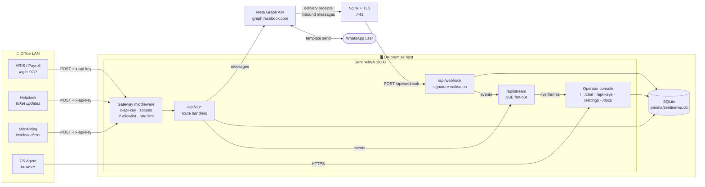

<div align="center">

# SentinelWA

**On-premise WhatsApp Business API gateway with a SOC-style operations console.**

One internal endpoint for every office application that needs to send an OTP, a notification
or an alert over WhatsApp — with live health telemetry, a streaming event log and an agent
inbox on top of it.

`Next.js 14` · `SQLite + Prisma` · `Server-Sent Events` · `OpenAPI 3.0` · `Tailwind` · `Recharts`

</div>

---

## Table of contents

1. [What this is](#1-what-this-is)
2. [Architecture & flow](#2-architecture--flow)
3. [Prerequisites](#3-prerequisites)
4. [Installation](#4-installation)
5. [On-premise deployment](#5-on-premise-deployment)
6. [Meta webhook setup](#6-meta-webhook-setup)
7. [Consuming the internal API](#7-consuming-the-internal-api)
8. [The operations console](#8-the-operations-console)
9. [Environment reference](#9-environment-reference)
10. [Security model](#10-security-model)
11. [Operations & troubleshooting](#11-operations--troubleshooting)
12. [Project layout](#12-project-layout)

---

## 1. What this is

Most offices end up with three or four applications that each want to send a WhatsApp message —
the HR portal wants login OTPs, the ticketing system wants status notifications, monitoring wants
alerts. Giving each of them the Meta access token means four copies of a credential, four
implementations of the template payload, and no single place to see what was sent.

SentinelWA is the single place. Internal applications call a small, stable HTTP API with their own
scoped `x-api-key`; SentinelWA holds the Meta credentials, talks to the Graph API, receives the
delivery receipts, and shows an operator what is happening.

**What it does**

| | |
|---|---|
| **Internal gateway** | `send-otp`, `send-message`, `status/{id}`, `health` — key-authenticated, scoped, rate-limited, IP-restricted |
| **SOC dashboard** | Service health matrix, runtime gauges, throughput/latency/delivery charts, streaming log console |
| **Webhook listener** | Signature-validated receiver for inbound messages, delivery receipts and template status changes |
| **CS command center** | Three-pane agent inbox with 24h service-window tracking and quick-response macros |
| **API explorer** | Swagger UI at `/docs`, generated from the same OpenAPI document the gateway serves |

**What it deliberately is not**: a multi-tenant SaaS. State that must be consistent — rate-limit
buckets, the circuit breaker, the SSE fan-out — lives in process memory, which is what makes the
whole thing run from one SQLite file with no Redis, no Postgres and no message broker. That is the
right trade for a single on-premise node. See [Scaling](#scaling-beyond-one-node) before you reach
for cluster mode.

---

## 2. Architecture & flow



### Request lifecycle — an OTP

```
 ┌──────────────┐   1. POST /api/v1/send-otp
 │  HRIS portal │──────────────────────────────────┐
 └──────────────┘   x-api-key: swa_live_…          │
                    { "to": "+62812…",             │
                      "code": "482913" }           ▼
                                        ┌────────────────────────┐
                                        │  Gateway middleware    │
                                        │  ① key hash lookup     │
                                        │  ② revocation check    │
                                        │  ③ IP allowlist        │
                                        │  ④ scope: otp.send     │
                                        │  ⑤ token bucket        │
                                        └───────────┬────────────┘
                                                    │ authorised
                                   2. row inserted  ▼
                                        ┌────────────────────────┐
                                        │ Message(status=queued) │──► SQLite
                                        └───────────┬────────────┘
                                   3. template send │  (circuit breaker guarded)
                                                    ▼
                                        ┌────────────────────────┐
                                        │  Meta Graph API        │
                                        │  POST /{phone-id}/…    │
                                        └───────────┬────────────┘
                                   4. wamid returned│
                                                    ▼
                                        status=sent ──► SSE ──► dashboard
                                                    │
      ┌─────────────────────────────────────────────┘
      │  5. minutes later, Meta calls back
      ▼
 POST /api/webhook  (x-hub-signature-256 verified)
      │
      └─► status=delivered → read     ──► SSE ──► dashboard + /api/v1/status/{id}
```

**Why the code is not stored.** `send-otp` records the *length* of the code and a reference string,
never the code itself. A gateway database that holds live one-time passwords is a credential store,
and it should not be one.

---

## 3. Prerequisites

| Requirement | Version | Notes |
|---|---|---|
| **Node.js** | ≥ 20.11 LTS (22 LTS recommended) | `node -v`. Node 18 will not run this build. |
| **npm / pnpm** | npm ≥ 10, or pnpm ≥ 9 | Either works; commands below show both. |
| **SQLite** | none to install | Prisma ships its own engine. The `sqlite3` CLI is only useful for manual inspection. |
| **Meta developer account** | — | See below. |
| **Public HTTPS endpoint** | — | Meta only delivers webhooks to a publicly reachable HTTPS URL with a valid certificate. Self-signed will not do. |
| **Build toolchain** | optional | Only needed if a native module has to compile on an unusual platform. |

### On the Meta side you need

1. A **Meta Business account** with a verified business.
2. A **Meta app** of type *Business* with the **WhatsApp** product added.
3. A **WhatsApp Business Account (WABA)** and a registered **phone number** (its *Phone Number ID*).
4. A **System User** with a **permanent access token** carrying `whatsapp_business_messaging` and
   `whatsapp_business_management`. Do not use the 24-hour temporary token from the quickstart panel
   for anything but a first smoke test.
5. An approved **authentication template** for OTP delivery (typically named `otp_verification`).
   Authentication templates are the only reliable way to reach a user outside the 24-hour service
   window.

> **Air-gapped hosts.** The app itself makes no build-time network calls — fonts are a plain CSS
> stack, not a Google Fonts fetch. `npm install` and `prisma generate` do need the internet once;
> after that the host only needs egress to `graph.facebook.com` and ingress for the webhook.

---

## 4. Installation

### 4.1 Clone and install

```bash
git clone <your-repo-url> SentinelWA
cd SentinelWA

npm install
# or: pnpm install
```

`postinstall` runs `prisma generate`, which downloads the Prisma query engine on first install.

### 4.2 Configure the environment

```bash
cp .env.example .env
```

Generate the two secrets the app refuses to start without in production:

```bash
node -e "console.log('ENCRYPTION_KEY=' + require('crypto').randomBytes(32).toString('hex'))" >> .env
node -e "console.log('SESSION_SECRET=' + require('crypto').randomBytes(32).toString('hex'))" >> .env
```

Then edit `.env` and set, at minimum:

```dotenv
APP_PUBLIC_URL=https://wa-gateway.corp.example.com
CONSOLE_PASSWORD=<a long passphrase for the operator console>
```

Meta credentials can go in `.env` **or** be typed into `/settings` later — settings entered in the
console are encrypted with AES-256-GCM and stored in SQLite, and they take precedence over `.env`.

> ⚠️ **`ENCRYPTION_KEY` is not rotatable in place.** Change it and every stored Meta credential
> becomes undecryptable; you will have to re-enter them in `/settings`. Back it up with the same
> care as the token it protects.

### 4.3 Initialise the database

```bash
# Local development — creates the file and applies migrations
npx prisma migrate dev

# Production / repeatable deploys — applies committed migrations only
npx prisma migrate deploy
```

The database file lands at `prisma/sentinelwa.db` (per `DATABASE_URL`). It is in `.gitignore`;
back it up as a file — see [Backups](#backups).

Inspect it any time with:

```bash
npx prisma studio
```

### 4.4 Issue the first API key

Without a key nothing can call the gateway. Either open `/api-keys` in the console, or from the
shell:

```bash
npm run key:create -- --name "hris-payroll" --scopes otp.send,status.read --rate 240
```

```
  ┌─ SentinelWA :: credential issued ────────────────────────────
  │  consumer  hris-payroll
  │  scopes    otp.send,status.read
  │  limit     240 req/min
  │  sources   any
  ├──────────────────────────────────────────────────────────────
  │  swa_live_9f2a1c4e7b8d3a05f6c1e9b2d7a4f083c5e6b1d9
  └─ store it now — only the SHA-256 digest is persisted ────────
```

The plaintext is shown **once**. Only `SHA-256(key)` is written to the database, so a stolen
database backup cannot be replayed against the gateway.

### 4.5 Run it

```bash
# Development — hot reload on http://localhost:3000
npm run dev

# Production
npm run build
npm run start
```

Useful extras:

```bash
npm run typecheck      # tsc --noEmit
npm run lint           # next lint
npm run db:studio      # Prisma Studio
```

---

## 5. On-premise deployment

The shape: **Nginx terminates TLS on :443 → Node listens on :3000, bound to localhost.**
Node is never exposed directly.

### 5.1 Build and place the app

```bash
sudo mkdir -p /opt/sentinelwa && sudo chown "$USER" /opt/sentinelwa
cd /opt/sentinelwa
git clone <your-repo-url> .

npm ci
cp .env.example .env && $EDITOR .env      # fill in secrets
npx prisma migrate deploy
npm run build
mkdir -p logs
```

### 5.2 Run under PM2

```bash
npm install -g pm2

pm2 start ecosystem.config.js --env production
pm2 save
pm2 startup            # prints a command — run it with sudo to survive reboot
```

Day-to-day:

```bash
pm2 status
pm2 logs sentinelwa --lines 100
pm2 restart sentinelwa
pm2 reload sentinelwa      # graceful
pm2 monit
```

`ecosystem.config.js` deliberately pins `instances: 1` / `exec_mode: 'fork'`.

<a name="scaling-beyond-one-node"></a>
> **Do not switch to cluster mode without changes.** The rate-limit buckets, the Meta circuit
> breaker and the SSE fan-out all live in process memory. With four workers, a key limited to
> 120 req/min effectively gets 480, the breaker opens independently in each worker, and a dashboard
> only sees events from the worker its stream happened to land on. Vertical scaling is the
> supported path; horizontal scaling means moving those three things to Redis first.

### 5.3 Nginx reverse proxy

A complete, commented configuration ships at [`deploy/nginx.conf`](deploy/nginx.conf).

```bash
sudo cp deploy/nginx.conf /etc/nginx/sites-available/sentinelwa
sudo $EDITOR /etc/nginx/sites-available/sentinelwa      # set server_name
sudo ln -s /etc/nginx/sites-available/sentinelwa /etc/nginx/sites-enabled/
sudo nginx -t && sudo systemctl reload nginx
```

Two settings in that file are not optional:

```nginx
location /api/stream {
    proxy_pass http://sentinelwa_app;
    proxy_buffering off;        # without this, the live dashboard arrives in bursts
    proxy_read_timeout 24h;     # without this, the stream is cut every 60s
    gzip off;
    chunked_transfer_encoding on;
}
```

The config also shows where to restrict access. A sensible split:

| Path | Who should reach it |
|---|---|
| `/api/webhook` | The public internet — Meta must reach it |
| `/api/v1/*` | Office ranges only (`allow 10.0.0.0/8; deny all;`) |
| `/` (console) | Management LAN only |

### 5.4 TLS with Let's Encrypt

```bash
sudo apt install certbot python3-certbot-nginx
sudo mkdir -p /var/www/certbot

sudo certbot --nginx -d wa-gateway.corp.example.com

# renewal is installed as a systemd timer; verify it
sudo certbot renew --dry-run
systemctl list-timers | grep certbot
```

If the host has no inbound :80 from the internet, use a DNS-01 challenge with your provider's
certbot plugin instead.

### 5.5 Firewall

```bash
sudo ufw allow 80/tcp        # ACME + redirect
sudo ufw allow 443/tcp       # HTTPS
sudo ufw deny  3000/tcp      # Node stays behind Nginx
sudo ufw enable
```

### 5.6 Verify the deployment

```bash
# 1. Node is up behind the proxy
curl -s -o /dev/null -w '%{http_code}\n' https://wa-gateway.corp.example.com/login       # 200

# 2. The gateway rejects an unauthenticated call
curl -s https://wa-gateway.corp.example.com/api/v1/health | jq       # 401 UNAUTHORIZED

# 3. …and accepts a real key
curl -s -H "x-api-key: $SENTINEL_KEY" \
     https://wa-gateway.corp.example.com/api/v1/health | jq '.status'

# 4. SSE actually streams (you should see frames appear, not a hang then a dump)
curl -N https://wa-gateway.corp.example.com/api/stream
```

---

## 6. Meta webhook setup

### 6.1 Configure SentinelWA first

Open **`/settings`** and set:

| Field | Where it comes from |
|---|---|
| System User Permanent Access Token | Business Settings → System Users → Generate token |
| Phone Number ID | WhatsApp → API Setup |
| Business Account ID (WABA) | WhatsApp → API Setup |
| App Secret | App Dashboard → Settings → Basic |
| Webhook Verify Token | **You invent it.** Any long random string. |
| Public HTTPS origin | e.g. `https://wa-gateway.corp.example.com` |

Save, then press **Execute handshake**. It calls
`GET /{version}/{phone-number-id}` and reports the display number, verified name and quality
rating. A green result means the token, the phone number ID and the API version all agree.

The settings page shows the exact **callback URL** to paste into Meta:

```
https://wa-gateway.corp.example.com/api/webhook
```

### 6.2 Configure Meta

1. **App Dashboard → WhatsApp → Configuration → Webhook → Edit**
2. **Callback URL** — the URL above.
3. **Verify token** — the exact string you saved in `/settings`.
4. **Verify and save.** Meta immediately issues `GET /api/webhook?hub.mode=subscribe&…`;
   SentinelWA echoes `hub.challenge` when the token matches. A `INFO webhook Verification handshake
   accepted` line appears in the live log console at that moment.
5. **Manage → subscribe** to at least:
   - `messages` — inbound messages **and** all delivery receipts (`sent`, `delivered`, `read`, `failed`)
   - `message_template_status_update` — approval and rejection notices for your templates

### 6.3 Confirm it works

Send a WhatsApp message *to* your business number from a phone. Within a second or two:

- a `INFO webhook Inbound text from …` line appears in the log console,
- the contact appears in **`/chat`** with an unread badge,
- the **Webhook Listener** card on the dashboard flips to *operational* with a fresh timestamp.

### 6.4 If verification fails

| Symptom | Cause |
|---|---|
| Meta says "The callback URL or verify token couldn't be validated" | Token mismatch, or the URL is not reachable from the public internet. Check with `curl` **from outside your network**. |
| Verification passes, no callbacks arrive | You verified but never subscribed to the `messages` field. |
| `CRITICAL webhook Rejected payload with invalid x-hub-signature-256` | The **App Secret** in `/settings` is wrong, or is from a different app than the one whose webhook is firing. |
| Certificate errors in Meta's tester | Incomplete chain. Use `fullchain.pem`, not `cert.pem`. |

---

## 7. Consuming the internal API

Every call carries `x-api-key`. Every response carries `X-Request-Id`, and rate-limited
responses carry `X-RateLimit-Limit` / `-Remaining` / `-Reset`.

Interactive documentation with a working **Try it out** lives at **`/docs`**; the raw document is at
`/api/openapi`.

### 7.1 `POST /api/v1/send-otp`

Sends a one-time code through a Meta authentication template — deliverable outside the 24-hour
service window. Scope: `otp.send`.

<details open>
<summary><b>curl</b></summary>

```bash
curl -sS -X POST https://wa-gateway.corp.example.com/api/v1/send-otp \
  -H "Content-Type: application/json" \
  -H "x-api-key: swa_live_9f2a1c4e7b8d3a05f6c1e9b2d7a4f083c5e6b1d9" \
  -d '{
        "to": "+6281234567890",
        "code": "482913",
        "template_name": "otp_verification",
        "language": "en_US",
        "reference": "payroll-login-8823"
      }' | jq
```

```json
{
  "ok": true,
  "message_id": "wamid.HBgNNjI4MTIzNDU2Nzg5MBUCABEYEjc5N0YxRjA4…",
  "record_id": "clx8n2k9q0000v3l8f1p2c9d4",
  "status": "sent",
  "to": "6281234567890",
  "template": "otp_verification",
  "latency_ms": 412,
  "request_id": "a91f3c02b7d4e5f6"
}
```
</details>

<details>
<summary><b>JavaScript — fetch</b></summary>

```js
// otp.js — Node 20+ or any modern browser runtime
const GATEWAY = process.env.SENTINEL_URL ?? 'https://wa-gateway.corp.example.com';
const API_KEY = process.env.SENTINEL_KEY; // never hard-code this

export async function sendOtp(to, code, reference) {
  const res = await fetch(`${GATEWAY}/api/v1/send-otp`, {
    method: 'POST',
    headers: {
      'Content-Type': 'application/json',
      'x-api-key': API_KEY,
    },
    body: JSON.stringify({ to, code, reference }),
  });

  const body = await res.json();

  if (!res.ok) {
    // 429 → back off; 502 → Meta rejected it; 401/403 → your key is the problem
    const retryAfter = Number(res.headers.get('retry-after') ?? 0);
    throw Object.assign(new Error(body.error?.message ?? 'send-otp failed'), {
      code: body.error?.code,
      status: res.status,
      requestId: body.request_id,
      retryAfter,
    });
  }

  return body; // { message_id, record_id, status, latency_ms, … }
}

// usage
const otp = String(Math.floor(100000 + Math.random() * 900000));
const { message_id } = await sendOtp('+6281234567890', otp, 'payroll-login-8823');
console.log('dispatched', message_id);
```
</details>

<details>
<summary><b>Python — requests</b></summary>

```python
# otp.py
import os
import random
import requests

GATEWAY = os.environ.get("SENTINEL_URL", "https://wa-gateway.corp.example.com")
API_KEY = os.environ["SENTINEL_KEY"]          # never hard-code this

session = requests.Session()
session.headers.update({
    "Content-Type": "application/json",
    "x-api-key": API_KEY,
})


class SentinelError(RuntimeError):
    def __init__(self, message, code=None, status=None, request_id=None):
        super().__init__(message)
        self.code = code
        self.status = status
        self.request_id = request_id


def send_otp(to: str, code: str, reference: str | None = None, timeout: int = 20) -> dict:
    res = session.post(
        f"{GATEWAY}/api/v1/send-otp",
        json={"to": to, "code": code, "reference": reference},
        timeout=timeout,
    )
    body = res.json()

    if not res.ok:
        err = body.get("error", {})
        raise SentinelError(
            err.get("message", "send-otp failed"),
            code=err.get("code"),
            status=res.status_code,
            request_id=body.get("request_id"),
        )

    return body


if __name__ == "__main__":
    otp = f"{random.randint(0, 999999):06d}"
    result = send_otp("+6281234567890", otp, reference="payroll-login-8823")
    print("dispatched", result["message_id"], f'in {result["latency_ms"]}ms')
```
</details>

### 7.2 `POST /api/v1/send-message`

Transactional or agent messages. Scope: `message.send`.

```bash
# Free-form text — ONLY inside the 24h service window
curl -sS -X POST https://wa-gateway.corp.example.com/api/v1/send-message \
  -H "Content-Type: application/json" \
  -H "x-api-key: $SENTINEL_KEY" \
  -d '{
        "to": "+6281234567890",
        "message": "Ticket INC-4821 has been resolved. Reply here if anything is still wrong.",
        "type": "text"
      }' | jq

# Template — valid at any time
curl -sS -X POST https://wa-gateway.corp.example.com/api/v1/send-message \
  -H "Content-Type: application/json" \
  -H "x-api-key: $SENTINEL_KEY" \
  -d '{
        "to": "+6281234567890",
        "message": "ticket_resolved",
        "type": "template",
        "language": "en_US",
        "components": [
          { "type": "body", "parameters": [
              { "type": "text", "text": "INC-4821" },
              { "type": "text", "text": "Network Operations" }
          ]}
        ]
      }' | jq
```

### 7.3 `GET /api/v1/status/{message_id}`

Accepts either the Meta `wamid.…` or the `record_id` returned at dispatch. Scope: `status.read`.

```bash
curl -sS -H "x-api-key: $SENTINEL_KEY" \
  "https://wa-gateway.corp.example.com/api/v1/status/wamid.HBgNNjI4MTIzNDU2Nzg5MBUC…" | jq
```

```json
{
  "ok": true,
  "message_id": "wamid.HBgNNjI4MTIzNDU2Nzg5MBUC…",
  "status": "read",
  "to": "6281234567890",
  "direction": "outbound",
  "timeline": {
    "created_at":   "2026-08-25T09:14:02.104Z",
    "sent_at":      "2026-08-25T09:14:02.516Z",
    "delivered_at": "2026-08-25T09:14:04.880Z",
    "read_at":      "2026-08-25T09:15:41.002Z",
    "failed_at":    null
  },
  "error": null,
  "request_id": "7d1e0c93aa5b2f48"
}
```

### 7.4 `GET /api/v1/health`

Returns `200` when healthy and **`503`** when a subsystem is down — so a load balancer or uptime
monitor can act on the status code alone. Scope: `health.read`.

```bash
curl -sS -H "x-api-key: $SENTINEL_KEY" \
  https://wa-gateway.corp.example.com/api/v1/health | jq
```

```json
{
  "ok": true,
  "status": "operational",
  "uptime_seconds": 184920,
  "system":    { "node": "v22.11.0", "cpu_percent": 3.4, "memory_percent": 41.2, "event_loop_p99_ms": 1.8 },
  "database":  { "ok": true, "read_ms": 0.31, "write_ms": 0.12, "size_bytes": 2179072 },
  "meta_api":  { "reachable": true, "latency_ms": 128, "circuit_breaker": "closed", "configured": true },
  "webhook":   { "last_payload_at": "2026-08-25T09:15:41.002Z", "queue_depth": 0, "error_rate": 0 },
  "request_id": "c40b8e1f92d3a765"
}
```

### 7.5 Error contract

Every failure returns the same envelope:

```json
{
  "ok": false,
  "error": { "code": "RATE_LIMITED", "message": "Rate limit of 120 requests/minute exceeded." },
  "request_id": "e2a7…"
}
```

| HTTP | `error.code` | What to do |
|---|---|---|
| 400 | `VALIDATION_ERROR` | Fix the payload — `error.details` names the offending fields. |
| 401 | `UNAUTHORIZED` | Missing or unknown `x-api-key`. |
| 403 | `KEY_REVOKED` / `IP_NOT_ALLOWED` / `FORBIDDEN_SCOPE` | Operator action needed in `/api-keys`. |
| 404 | `NOT_FOUND` | No message with that identifier. |
| 428 | `NOT_CONFIGURED` | Meta credentials are not set. Visit `/settings`. |
| 429 | `RATE_LIMITED` | Honour `Retry-After`; do not hot-loop. |
| 502 | `META_ERROR` | Meta rejected it — `error.details` carries their code. Usually a template or window problem. |
| 503 | `CIRCUIT_OPEN` | Meta is failing; the breaker is shielding you. Retry after the window. |

**Quote `request_id` when reporting a problem** — it appears verbatim in the log console and makes
the incident findable in one search.

---

## 8. The operations console

| Route | What it is for |
|---|---|
| **`/`** | Health matrix (runtime, Meta gateway, webhook, database), runtime gauges, throughput / latency / message-flow / delivery charts, top consumers, live log console, message tap |
| **`/chat`** | Three-pane agent inbox: triage list with unread markers, conversation, inspector with a live 24h service-window countdown. Macros expand from `/shortcut` or `Ctrl`+`K`. |
| **`/api-keys`** | Issue, scope, throttle, IP-restrict, revoke and reinstate credentials |
| **`/settings`** | Meta credentials, callback URL generator, API version, simulation mode, handshake test |
| **`/docs`** | Swagger UI against the live gateway |

**The log console** filters by severity and free text, pauses without losing frames (held lines are
flushed on resume), clears the on-screen buffer without touching the database, and exports the
filtered set as JSON or CSV. Auto-scroll follows the tail only while you are already at the bottom —
scrolling up to read a stack trace detaches it, and *jump to tail* reattaches.

**Simulation mode** (`/settings`, or `MOCK_META=true`) acknowledges every dispatch locally with a
synthetic `wamid` and sends no packet to Meta. Use it for drills, demos and offline development.

**Colour is never the only signal.** Every state is labelled, delivery segments are directly
labelled beside the ring, and the chart series palette is validated for colour-vision deficiency
against the dark surface.

---

## 9. Environment reference

| Variable | Default | Purpose |
|---|---|---|
| `NODE_ENV` | `development` | `production` enables the secret assertions. |
| `PORT` | `3000` | Node listen port. |
| `APP_PUBLIC_URL` | — | Public HTTPS origin; used to build the callback URL and the OpenAPI server entry. |
| `DATABASE_URL` | `file:./sentinelwa.db` | SQLite path, resolved relative to `prisma/`. |
| `ENCRYPTION_KEY` | — | **Required in production.** 32 bytes, hex or base64. Encrypts stored Meta credentials. Not rotatable in place. |
| `SESSION_SECRET` | — | **Required in production.** Signs the operator session cookie. |
| `CONSOLE_PASSWORD` | — | Gates the console. Blank disables the login entirely. |
| `META_API_VERSION` | `v21.0` | Graph API version. |
| `META_ACCESS_TOKEN` | — | System user permanent token. |
| `META_PHONE_NUMBER_ID` | — | Sending number. |
| `META_WABA_ID` | — | Business account, used for the handshake report. |
| `META_APP_SECRET` | — | Validates `x-hub-signature-256`. |
| `META_WEBHOOK_VERIFY_TOKEN` | — | Must match the App Dashboard field exactly. |
| `META_OTP_TEMPLATE_NAME` | `otp_verification` | Default authentication template. |
| `META_OTP_TEMPLATE_LANG` | `en_US` | Default template language. |
| `MOCK_META` | `false` | Simulate dispatches with no outbound traffic. |
| `DEFAULT_RATE_LIMIT_PER_MIN` | `120` | Applied to a newly created key. |
| `GLOBAL_IP_WHITELIST` | *(empty)* | Gateway-wide allowlist, checked before per-key rules. Read from the environment at request time. |
| `LOG_RETENTION_DAYS` | `14` | Age at which `pruneOldRecords()` trims logs, metrics and webhook envelopes. |
| `LOG_MIN_LEVEL` | `INFO` | Minimum severity persisted to SQLite. Lower lines still stream live. |
| `BREAKER_FAILURE_THRESHOLD` | `5` | Consecutive Meta failures before the breaker opens. |
| `BREAKER_RESET_MS` | `30000` | Time the breaker stays open before a half-open probe. |

Values entered in `/settings` are stored encrypted in SQLite and **take precedence** over `.env`.
`.env` is the bootstrap; the console is the runtime.

---

## 10. Security model

**Credentials at rest.** API keys are stored as `SHA-256(key)` — the plaintext exists only in the
response that created it. Meta credentials are AES-256-GCM encrypted with `ENCRYPTION_KEY` before
they reach SQLite.

**Gateway authorisation**, in order, cheapest first so a prober learns as little as possible:
① key present → ② hash lookup → ③ revocation → ④ global then per-key IP allowlist →
⑤ scope → ⑥ per-key token bucket.

**Webhook authentication is the signature.** `POST /api/webhook` takes no API key; it verifies
`x-hub-signature-256` as an HMAC-SHA256 of the raw body against the app secret, compared in constant
time. Every envelope is persisted — including rejected ones — so a signature failure is
investigable rather than merely logged.

**Console sessions** are HMAC-signed expiry stamps in an `httpOnly`, `sameSite=lax` cookie, `secure`
in production, 12-hour lifetime, with no server-side session store. Login attempts are throttled to
10/minute per source address.

**Hardening headers** — `X-Frame-Options`, `X-Content-Type-Options`, `Referrer-Policy` and a
restrictive `Permissions-Policy` — are applied by the edge middleware on every response.

**Recommended posture**

- Give each consuming application its own key, with the narrowest scopes it needs. Revoking one must
  never take the others down.
- Set per-key IP allowlists. An office service has a predictable source address.
- Expose only `/api/webhook` to the internet; keep `/api/v1/*` and the console on the LAN.
- Rotate keys on a schedule — revoke leaves the audit trail intact, purge does not.
- Watch for `CRITICAL auth` lines. Blocked source addresses and invalid signatures both log there.

---

## 11. Operations & troubleshooting

### Backups

The whole datastore is one file plus its WAL sidecars. Back it up **without stopping the app**:

```bash
sqlite3 prisma/sentinelwa.db ".backup '/backup/sentinelwa-$(date +%F).db'"
```

```bash
# nightly at 02:30
30 2 * * * sqlite3 /opt/sentinelwa/prisma/sentinelwa.db \
  ".backup '/backup/sentinelwa-$(date +\%F).db'" && \
  find /backup -name 'sentinelwa-*.db' -mtime +30 -delete
```

Back up `.env` separately and just as carefully — without `ENCRYPTION_KEY` the credentials in that
database are unreadable.

### Retention

`pruneOldRecords()` trims `LogEntry`, `RequestMetric` and `WebhookEvent` older than
`LOG_RETENTION_DAYS`. Call it from a cron job or a scheduled task:

```bash
0 3 * * * cd /opt/sentinelwa && npx tsx -e "import('./src/lib/logger').then(m => m.pruneOldRecords().then(console.log))"
```

### Symptom index

| Symptom | Likely cause | Fix |
|---|---|---|
| Dashboard shows `sse error` | Nginx is buffering or timing out the stream | Confirm `proxy_buffering off` and a long `proxy_read_timeout` on `/api/stream` |
| Dashboard updates in bursts, then a flood | Same | Same |
| Every send returns `428 NOT_CONFIGURED` | Meta credentials absent | Fill in `/settings`, then run the handshake |
| Every send returns `503 CIRCUIT_OPEN` | 5 consecutive Meta failures opened the breaker | Fix the underlying error, then a successful handshake in `/settings` resets it |
| `502 META_ERROR` mentioning a template | Template not approved, wrong name, or wrong language code | Check the template in the Meta dashboard; language must match exactly (`en_US`, not `en`) |
| Free-form text rejected, templates work | The 24-hour service window has closed | Use an approved template — the inbox shows the countdown per contact |
| `CRITICAL webhook Rejected payload with invalid signature` | Wrong app secret | Re-copy it from App Dashboard → Settings → Basic |
| Webhook verification fails at Meta | Verify token mismatch, or the URL is not publicly reachable | Test with `curl` from outside your network |
| `@prisma/client did not initialize yet` | `prisma generate` never ran | `npx prisma generate` |
| `PrismaClientInitializationError` at start | `DATABASE_URL` path is wrong or unwritable | Check the path and that the process owns `prisma/` |
| Console redirects to `/login` forever | `SESSION_SECRET` changed, invalidating issued cookies | Clear the cookie and log in again |
| Rate limits look doubled | PM2 running in cluster mode | Set `instances: 1`, `exec_mode: 'fork'` |
| Fonts look wrong | JetBrains Mono / Fira Code not installed on the client | Install one, or accept the system monospace fallback |

### Reading the log console

```
18:49:03.491  WARN      auth      Missing x-api-key on GET /api/v1/health          meta
              ▲         ▲         ▲                                                ▲
              severity  channel   message                                    click for JSON context
```

Channels: `system` · `api` · `meta` · `webhook` · `db` · `auth` · `console`.

---

## 12. Project layout

```
SentinelWA/
├── prisma/
│   ├── schema.prisma              # 8 models: keys, settings, contacts, messages,
│   │                              # logs, webhook envelopes, request metrics, macros
│   └── migrations/                # committed SQL — `migrate deploy` applies these
├── scripts/
│   └── create-api-key.ts          # headless credential bootstrap
├── deploy/
│   └── nginx.conf                 # commented reverse-proxy config with SSE settings
├── ecosystem.config.js            # PM2 process definition (single instance, on purpose)
├── src/
│   ├── middleware.ts              # edge: request id, hardening headers, console gate
│   ├── app/
│   │   ├── page.tsx               # SOC dashboard
│   │   ├── chat/                  # CS command center
│   │   ├── api-keys/              # credential manager
│   │   ├── settings/              # Meta uplink
│   │   ├── docs/                  # Swagger UI
│   │   ├── login/
│   │   └── api/
│   │       ├── v1/                # send-otp · send-message · status/[id] · health
│   │       ├── webhook/           # GET verification · POST receiver
│   │       ├── stream/            # SSE fan-out
│   │       ├── openapi/           # generated OpenAPI 3.0 document
│   │       └── console/           # operator-only endpoints
│   ├── components/
│   │   ├── StreamProvider.tsx     # one EventSource shared by every panel
│   │   ├── shell/                 # sidebar · top bar · app shell
│   │   ├── dashboard/             # health matrix · gauges · charts · terminal
│   │   ├── chat/                  # three-pane inbox
│   │   ├── keys/  settings/
│   └── lib/
│       ├── api-auth.ts            # the gateway middleware (key, scope, IP, rate limit)
│       ├── meta.ts                # Graph API client, handshake, ping
│       ├── circuit-breaker.ts     # closed → open → half-open
│       ├── messaging.ts           # message lifecycle + webhook ingestion
│       ├── telemetry.ts           # health snapshot + chart aggregation
│       ├── bus.ts                 # in-process event bus behind SSE
│       ├── crypto.ts              # AES-256-GCM, key hashing, signature validation
│       ├── rate-limit.ts          # token bucket
│       ├── settings.ts            # encrypted runtime configuration
│       └── theme.ts               # validated chart + status palette
└── .env.example
```

---

<div align="center">
<sub>SentinelWA · internal use · every credential in this document is a placeholder</sub>
</div>
